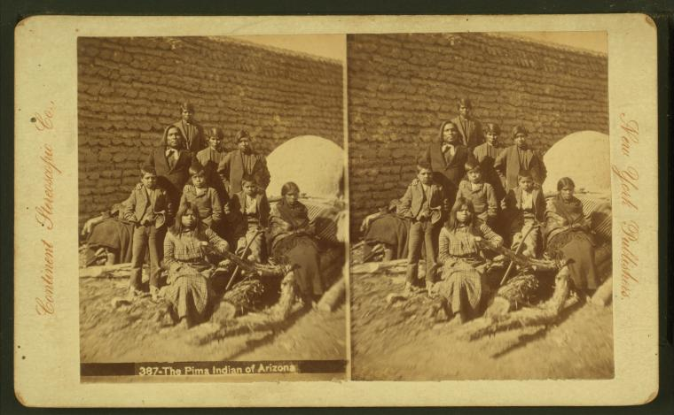

# Bringing Stereo to Life

In this project we look at how to generate videos from stereo cards.

These cards are taken such that if you were to view the images from different eyes
then you would obtain a notion of 3D.
However, we wonder if you could take these two images and be able to both interpolate
and extrapolate between these two images.
An example is shown below.

 

 <b>Original StereoCard:</b> The Pima Indian of Arizona

 

 <b>Generated Video</b>

## How does it work?

The method proceeds as follows:
1. Figure out a dense correspondence between the pairs of the images using DTW (and 
potentially first preprocessing by using SIFT correspondences in order to 
first pre warp the images). This happens in `./dynamic_time_warping.py`.
2. Then use the warp to generate a video interpolating between the images and
extrapolating outside the perimeter. The projection code is based on that of
[SynSin](http://www.robots.ox.ac.uk/~ow/synsin.html). This happens in `./generate_video.py`.
3. Then finally fill in the holes using a generative model based on the [Boundless model](https://arxiv.org/abs/1908.07007). This is done for each pair separately. The code is in `./train_boundless.py`.

To run the code on a single sample, look at `./single_sample.sh`.

## Data download
To download and preprocess the data, look at `./data/nyplstereo.py`. (But you first need
to obtain a token from the New York Public Library API and fill in the string marked XXXXXXX.)
This does the following:
- Downloads the high resolution stereo cards 
- Downloads the title of the stereo cards
- Splits the stereo cards into left and right

## Further work
If you want to contribute, here are some interesting future points of work:

1. The method is quite slow, especially the inpainting part as I'm doing this separately for each pair.
A faster way would be to train one model for all pairs. However, this may not generalise so well.
